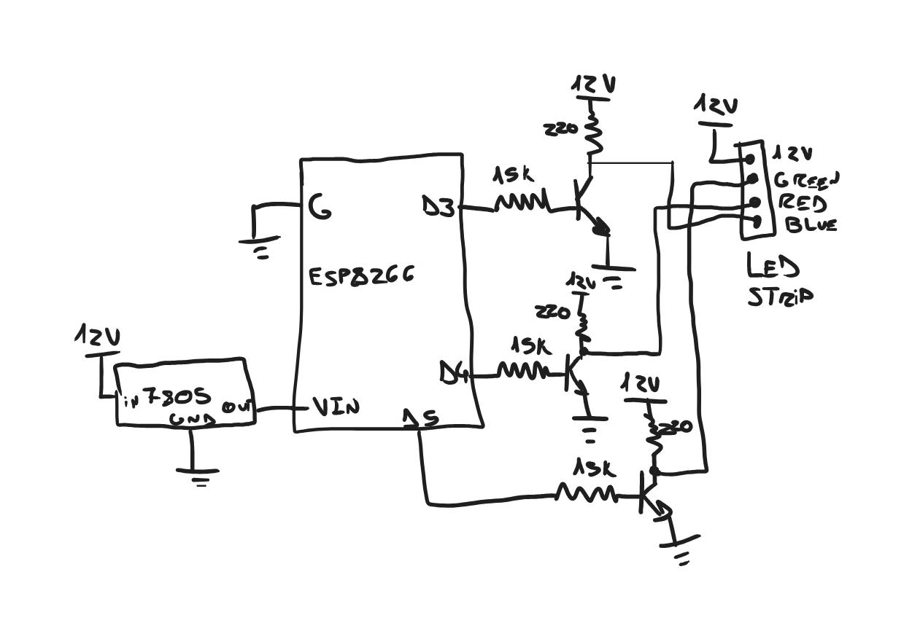

# RGB Light Controller

I've always had an LED strip, but some time ago the controller, which used a remote control, broke, so I needed a new one. I thought I could make one, a better one, an this is it.

This LED Strip controller uses a ESP8266, it creates a web server where you can select the modes or individual colors you want to see.

It is a pretty simple project, I had fun while making it, and I know that you would too.

## Hardware needed

- ESP8266 (In my case I used NodeMCU v3)
- x3 BC550B Transistor (you can use MOSFETS if you like, but these ones are cheaper)
- x3 220ohm resistors
- x3 15kohm resistors
- 12V Power supply (depending on your LED Strip, it could be more or less)
- LM7805 (Or any other 5V or 3,3V Regulator)
- The LED strip (It should NOT be adressable, for reference, you need the one that has 4 pins, VCC, Red, Green and Blue)

## Circuit Schematic

